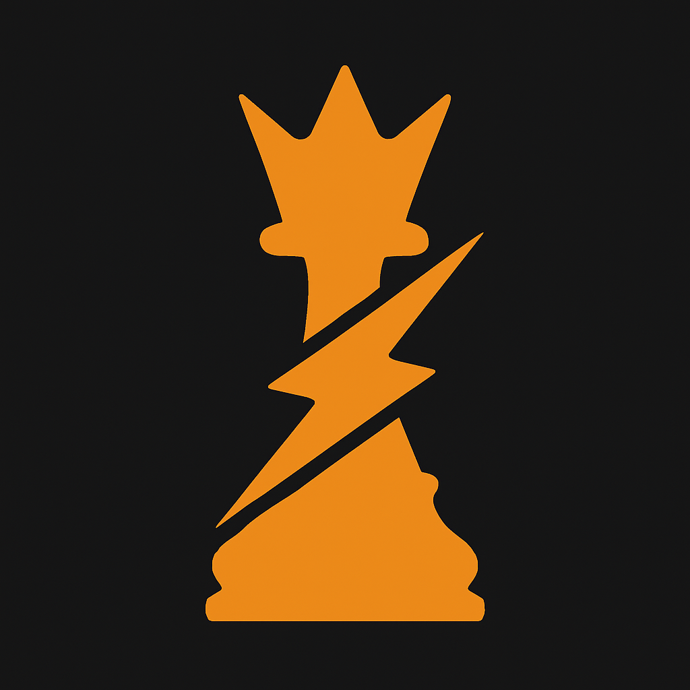

# zigqueen

<p align="center"></p>

zigqueen is a UCI chess engine written in Zig (0.15.2) with a from-scratch
NNUE evaluation and a single-threaded alpha-beta search. Engine code is a
clean-room implementation (see `CLEAN_ROOM_RULES.md`); the network is trained
from the publicly published Stockfish NNUE training datasets.

Copyright (C) 2026 stierms — licensed under GPLv3 (see `LICENSE`). The
vendored Fathom tablebase prober (`deps/fathom`) is distributed under its own
MIT-style license, kept intact in its source headers.

## How this engine was built (AI disclosure)

zigqueen was written by [stierms](https://github.com/stierms) together with
an AI assistant (Anthropic's Claude), and it is worth being specific about
what that means, because "AI-written" can mean very different things.

Claude wrote most of the source code. It did so under continuous human
direction: stierms set the goals, chose which ideas to pursue or abandon,
approved every experiment that cost machine time, and decided what shipped.
Neither party worked unsupervised — the AI proposed and implemented, the
human steered, questioned, and vetoed.

Crucially, nothing was accepted because it sounded plausible. Every change
had to survive measurement before it entered the engine:

- **Strength claims** were decided by SPRT self-play matches (thousands of
  games), then re-checked at a deploy-relevant time control, then sanity-
  checked against outside engines. Several changes that looked good in
  theory — and a few that looked good at fast time controls — were measured,
  found wanting, and reverted.
- **Performance claims** had to be *node-identical*: the optimized engine
  must search exactly the same tree as before, proven by matching node counts
  and principal variations at fixed depth, with timings taken as the minimum
  of repeated runs on an idle machine.
- **Correctness** rests on perft suites, make/unmake invariants, and
  bit-exactness checks of the NNUE inference against an independent
  reference implementation of the trainer's arithmetic.

The failed experiments are as much a part of the record as the successful
ones; the git history and `docs/` describe both. Commit trailers preserve
the co-authorship attribution.

`CLEAN_ROOM_RULES.md` documents the originality rules the project was
developed under — no code was copied or translated from other engines.

## Strength

| Engine version | Self-assessment (blitz 180s+1s) | CCRL Blitz (2'+1") | CCRL 40/15 |
|---|---|---|---|
| v5.8.3 | ~3590 — 1,620-game anchored gauntlet, 2026-07-26 ([methodology](docs/STRENGTH.md)) | **3569 ±16** (#76–77, [official listing](https://computerchess.org.uk/ccrl/404/cgi/engine_details.cgi?print=Details&eng=ZigQueen%205.8.3%2064-bit)) | — |
| v5.8.2 | ~3594 — 1,620-game anchored gauntlet, 2026-07-25 ([methodology](docs/STRENGTH.md)) | — | — |
| v5.8.0 | ~3588 — 1,620-game anchored gauntlet, 2026-07-19 ([methodology](docs/STRENGTH.md)) | — | — |

The official CCRL Blitz rating (951 games, first listed 2026-08-01) is the
authoritative number. The self-assessment anchors a private gauntlet to
published CCRL Blitz ratings; it landed within ~20 Elo of the official
result — treat it as an estimate (~±20).

## Development hardware

Everything — engine development, NNUE training, and all strength testing —
was done on a single desktop machine:

| | |
|---|---|
| CPU | AMD Ryzen 9 9950X3D (16 cores / 32 threads, 128 MB V-cache) |
| GPU | NVIDIA GeForce RTX 4090 (24 GB) — NNUE training only |
| RAM | 128 GB |
| OS | Windows 11 with WSL2 (Ubuntu) — training and testing run under WSL2; Windows binaries are cross-compiled with Zig |

No cluster, no distributed testing framework, and no external compute: the
network trains on the one GPU (about 30 hours for the shipped net), and the gauntlets
and SPRT matches run on the same box's CPU cores. (The only exception is
the published release binaries, which are built by GitHub Actions so that
anyone can reproduce them from the tagged source.)

## Features

**Evaluation** — pure NNUE ("ZQB8" format, ~30 MB net embedded in the binary):

- HalfKA feature transformer, 8 king buckets with horizontal mirroring, width 1536
- lean threat-feature set (7,680 attacker->target features) with custom
  incremental non-local update algorithms
- PSQT head and a bucketed SFNNv-style layerstack readout (l1/l2 with i8
  VNNI matmul)
- incremental accumulators with lazy materialization and a finny-style
  refresh cache
- trained with the [bullet](https://github.com/jw1912/bullet) trainer on
  the publicly published Stockfish NNUE training datasets — see
  [docs/NETWORK.md](docs/NETWORK.md) for exactly what was and was not used

**Search** — negamax + iterative deepening, aspiration windows:

- clustered transposition table with static-eval caching, huge-page backed;
  dedicated 2-way eval cache
- null move with verification, probcut, singular extensions,
  desperation-conditioned check extensions
- LMR (runtime-shaped table), RFP, razoring, futility, history and SEE pruning
- killer/countermove/main/continuation/correction history; staged
  TT-move-first generation at depth 1
- SEE-gated quiet checks at the first qsearch ply
- Syzygy WDL probing via Fathom

**Performance** — AVX-512/AVX2 SIMD via Zig `@Vector` (portable, bit-exact),
LTO, transparent-huge-page self-enable on Linux/WSL2, Windows large pages,
optional llvm-bolt post-link pass.

## Build

Requires Zig 0.15.2:

```bash
zig build -Doptimize=ReleaseFast
zig build test
./zig-out/bin/zigqueen
```

The default build targets the native CPU. Portable release binaries use
`-Dcpu-baseline=avx2` (x86-64-v3: AVX2, no AVX-512 — runs on Haswell/Zen 1
and newer) or `-Dcpu-baseline=avx512` (x86-64-v4 + VNNI — Ice Lake/Zen 4 and
newer); all variants are bit-exact, only speed differs. Windows binaries
cross-compile with `-Dtarget=x86_64-windows-gnu`. `scripts/package-release.sh`
builds and zips all four release variants into `release/`.

## UCI options

| Option | Type | Default | Description |
|---|---|---|---|
| `Hash` | spin | 256 | Transposition table size in MB (1-65536); also sizes the eval cache. |
| `Threads` | spin | 1 | Search threads. The engine is single-threaded; fixed at 1. |
| `Move Overhead` | spin | 20 | Per-move time reserve in ms for GUI/connection latency (0-1000). |
| `NNUE Scale Percent` | spin | 66 | Eval scaling in percent (0-400). The default is the calibrated value; changing it is not recommended. |
| `SyzygyPath` | string | empty | Directories containing Syzygy tablebases (WDL probing). |
| `Contempt` | spin | 0 | Draw contempt in centipawns (-200 to 200); 0 = classical draw scoring. |
| `EvalFile` | string | `<builtin>` | Path to an external `.zqb` net; leave at `<builtin>` for the embedded net. |

## Platform notes

**Android**: each release ships OEX engine APKs (auto-discovered by Chess for
Android, DroidFish and other OEX-compatible GUIs) plus raw aarch64 binaries;
the ARM build is bit-identical to x86 by design. See [docs/ANDROID.md](docs/ANDROID.md).

- **Linux/WSL2:** the engine transparently enables 2 MB huge pages for its
  large tables (THP `madvise`), no setup needed.
- **Windows:** large pages need `SeLockMemoryPrivilege` — grant "Lock pages
  in memory" (secpol.msc) once and re-login; otherwise the engine silently
  uses regular pages. See `docs/WINDOWS_BUILD.md`.

## Documentation

- `docs/STRENGTH.md` — gauntlet methodology and per-opponent results
- `docs/ARCHITECTURE.md` — module map, NNUE and search architecture
- `docs/TUNING.md`, `docs/QUALITY_GATES.md` — validation methodology
- `docs/WINDOWS_BUILD.md` — Windows builds and large pages
- `CLEAN_ROOM_RULES.md` — clean-room policy

## Acknowledgments

- The [Stockfish](https://stockfishchess.org/) project and its community,
  whose openly published NNUE training datasets made the network possible.
- [bullet](https://github.com/jw1912/bullet), the NNUE trainer.
- [Fathom](https://github.com/jdart1/Fathom) for Syzygy probing.
- The engine-testing ecosystem, especially
  [fastchess](https://github.com/Disservin/fastchess), and the computer
  chess community's published research.

## License

GPLv3 — see `LICENSE`. `deps/fathom` retains its original MIT-style license
notice.
