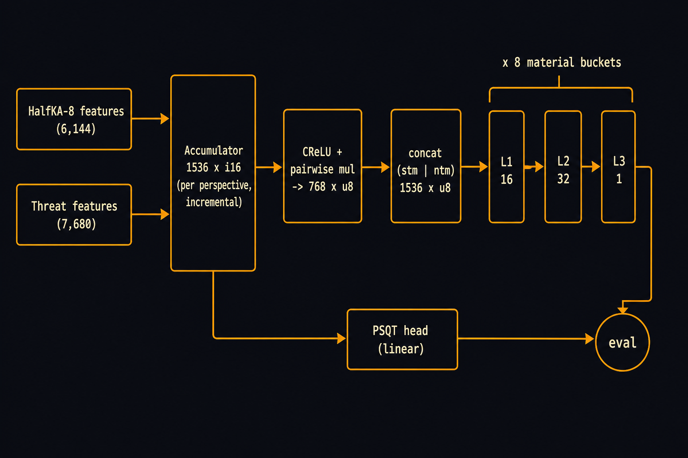
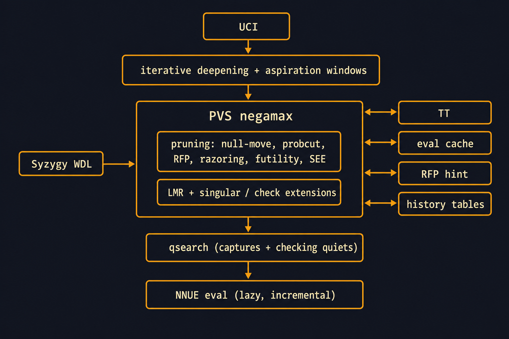

# zigqueen architecture

zigqueen is a single-threaded UCI chess engine written in Zig, built around a
bitboard position model, an NNUE evaluation with incrementally updated
accumulators, and a PVS/negamax search with a modern pruning and extension
stack. This document maps the source tree and records the design decisions
that matter for correctness and performance.

## Module map

```
src/
  main.zig        entry point: UCI loop plus diagnostic subcommands (bench, perft, ...)
  core/           board fundamentals: bitboards, squares, pieces, moves,
                  Position/StateInfo, FEN, zobrist hashing
  movegen/        attack tables (magics), pseudo-legal generation, legality
                  filtering, make/unmake, perft
  eval/           NNUE runtime (nnue768.zig), threat-feature enumeration
                  (threats.zig), eval backend dispatch, embedded default net
  search/         engine state, search context/stack, TT, eval cache, qsearch,
                  root/negamax, pruning, reductions (LMR), move ordering,
                  history tables, SEE, repetition, PV, Syzygy probing, time
                  management, runtime tunables
  uci/            UCI protocol, options, search worker integration
  tools/          offline diagnostics: bench, stability, search/eval profiling,
                  data extraction
  util/           huge-page allocation for large tables
deps/fathom/      Syzygy tablebase prober (C, vendored, MIT-style license)
```

Structural rules:

- No global mutable search state. Long-lived state (options, TT, history
  tables, NNUE weights) lives in `Engine`; per-search state (counters, stop
  control, search stack, PV, repetition history) lives in `SearchContext`.
- `Position` owns placement, occupancies, mailbox, side, castling, en passant,
  clocks, and hash; `StateInfo` owns reversible per-ply data. Make/unmake is
  the model, not copy-make.
- No heap allocation in search, movegen, make/unmake, or hot eval paths. Move
  lists, the search stack, and history tables are fixed-capacity dense arrays.

## NNUE evaluation



*(An annotated, editable SVG variant with the incremental-update details lives
at [diagrams/net-architecture-annotated.svg](diagrams/net-architecture-annotated.svg).)*

The evaluator is a pure NNUE (no hand-crafted evaluation) in the engine's own
`ZQB` family of net formats, loaded from an embedded ~30 MB net
(`src/eval/default_net.zqb`) or an external file via the `EvalFile` UCI
option. The deployed generation is **ZQB8**:

- **Feature transformer — HalfKA-8.** Standard Chess768 features (color x
  piece type x square, 768 per block) replicated over 8 king buckets with
  horizontal mirroring: per perspective, the bucket is chosen by that side's
  own king square (black's frame is rank-flipped via `sq ^ 56`), and files
  e-h are mirrored onto a-d. Accumulator width is 1536 per perspective, i16
  quantized.
- **Threat features.** A lean SFNNv10-style threat set: 7,680 features
  encoding attacker piece -> occupied target square -> target piece
  relations (kings are targets, never sources), deduplicated per perspective
  as a 7,680-bit set. Threat rows are stored i8 and added into the same
  accumulator as the HalfKA rows.
- **PSQT head.** A per-feature scalar head, bucketed alongside the output
  buckets (Stockfish-style), added outside the nonlinear stack.
- **Layerstack readout.** An SFNNv5-style output stack per material bucket:
  clipped-ReLU + pairwise multiply on the accumulator halves, then
  l1 (i8 weights, VNNI/dot-product matmul) -> squared-clipped-ReLU -> l2 ->
  l3 -> scalar, blended with the PSQT head.

Inference uses portable `@Vector` SIMD (lowers to AVX-512/AVX2/NEON with a
scalar fallback); integer SIMD is bit-exact, so eval output is identical
across targets.

### Incremental update machinery

- **Per-ply accumulators.** `applyMove` edits the parent accumulator
  (add/sub of feature rows) instead of a full rebuild. Threat features are
  non-local (a move can create or destroy discovered attack relations across
  the board), so threat deltas are computed by a dedicated incremental
  algorithm rather than piece-list diffs.
- **Lazy materialization.** Accumulator edits are deferred until a node
  actually evaluates; nodes that cut off on TT hits or never reach a static
  eval skip the accumulator work entirely.
- **Finny table.** A per-(side, king-bucket/flip) cache of accumulator plus
  board snapshot. When a king move crosses a bucket or mirror boundary
  (which invalidates every feature of that perspective), the rebuild applies
  only the piece diff against the cached snapshot instead of a full refresh.

The net is trained with the [bullet](https://github.com/jw1912/bullet)
trainer on the publicly published Stockfish NNUE training datasets
(relabeled played-out game positions); the engine-side
mapping is validated bit-for-bit against a trainer-faithful reference.

## Search



Iterative deepening with aspiration windows around a PVS/negamax core.

- **Transposition table.** Clustered (2 entries per cluster, 24-byte
  entries), generation-based depth-preferred replacement, prefetched, and
  it caches the raw static eval so a TT hit without a cutoff still skips
  the NNUE forward pass.
- **Dedicated eval cache.** A 2-way set-associative, 1-bit-LRU memo of the
  raw static eval keyed by the full 64-bit zobrist key, sized off `Hash`.
  It gives TT-evicted positions a second chance: the TT's depth-preferred
  replacement evicts shallow entries whose static eval is still worth
  remembering.
- **Pruning/reductions:** null-move pruning with verification search,
  probcut, reverse futility pruning (with a prefetched hint table),
  razoring, futility pruning, history-based pruning, SEE pruning, and
  late-move reductions driven by a runtime-shaped table.
- **Extensions:** a singular-extension family, plus desperation-conditioned
  check extensions (checks extend at shallow depth always, and at any depth
  only when the static eval is at or below alpha — never while ahead, which
  keeps the branching factor position-aware).
- **Move ordering:** TT move first (staged generation at depth 1 avoids
  generating the full move list when the TT move cuts), captures by SEE,
  killers, countermove, main history, continuation history; correction
  history refines the static eval.
- **Quiescence:** captures/promotions plus SEE-gated quiet checks at the
  first qsearch ply (a direct-check generator keeps the horizon
  check-aware without a movegen pass).
- **Endgames:** Syzygy WDL probing at search time via the vendored Fathom
  prober (`SyzygyPath`).
- **Time management:** iteration-based budgeting with a `Move Overhead`
  guard; the per-node clock check is throttled off the hot path.

Search behavior at fixed depth is bit-deterministic, which the tooling
exploits: performance work is validated by node-identity (identical node
counts and PV at fixed depth) before any strength testing.

## Performance design decisions

- **Huge-page backing for random-access tables.** The TT, RFP-hint table,
  eval cache, continuation history, and multi-MB NNUE weight blocks are
  zobrist- or feature-indexed random accesses over tens of MB; on 4 KB pages
  nearly every probe is a dTLB walk (a 64 MB table spans 16,384 pages). On
  Linux the allocator ladder is `MAP_HUGETLB` -> THP via
  `madvise(HUGEPAGE)` on a 2 MB-aligned region -> plain heap; on Windows it
  is `VirtualAlloc(MEM_LARGE_PAGES)` (self-enabling `SeLockMemoryPrivilege`
  when the account has been granted "Lock pages in memory") with a silent
  fallback to regular pages.
- **Prefetching.** TT and RFP-hint probes for the child position are
  prefetched at make time. Any new per-node randomly indexed table should be
  audited for the same treatment.
- **Cache-conscious layouts.** TT clusters and eval-cache sets are sized to
  cache lines (4 eval-cache entries per 64-byte line); the accumulator and
  weight blocks are 64-byte aligned.
- **Exact-output discipline.** Performance changes must preserve fixed-depth
  node identity; speed and strength are then judged separately. An optional
  llvm-bolt post-link pass (`scripts/bolt-optimize.sh`) reorders the hot
  text (layout-only, gated by the same node-identity check).

## Validation

- `zig build test` runs the unit/property suite (perft, make/unmake hash
  restoration, incremental-vs-refresh accumulator equivalence, TT and
  eval-cache invariants, UCI parsing).
- `./zig-out/bin/zigqueen stability 5` checks fixed-depth run-to-run
  stability; `bench` provides a fixed-node signature.
- Strength changes are gated by SPRT self-play plus periodic external
  gauntlets against other engines (see `docs/TUNING.md` and
  `docs/QUALITY_GATES.md`).
